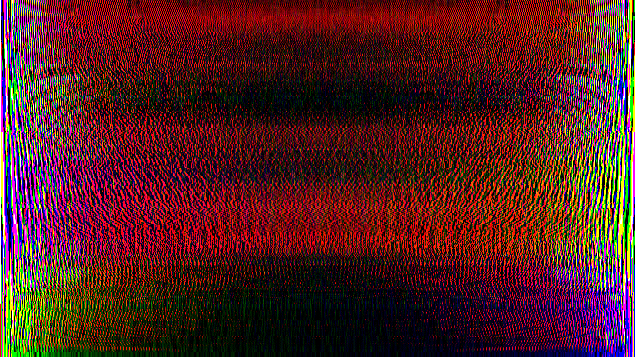
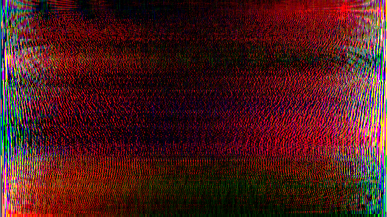
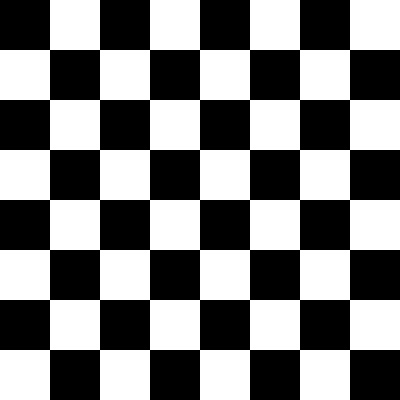

# Bài tập truyền thông đa phương tiện
### Thành viên nhóm:
```
Nguyễn Thanh Bình
Phạm Tiến Mạnh
Hoàng Đình Nam
Phan Tiến Phước
Nguyễn Hồng Quang
Lê Đức Toàn
Nguyễn Bá Toàn
```
### Cài đặt:
**Python version 3.7.5**\
**Các thư viện python sau:**
```
cycler==0.10.0
imageio==2.6.1
kiwisolver==1.1.0
matplotlib==3.1.2
numpy==1.17.4
opencv-python==4.1.2.30
Pillow==6.2.1
pyparsing==2.4.5
python-constraint==1.4.0
python-dateutil==2.8.1
scipy==1.3.3
six==1.13.0
pygame==1.9.6
```
### Hướng dẫn:
**Bài 1:**
* Lệnh:
```
python bai1-1.py	# Vẽ đồ thị 1
python bai1-2.py	# Vẽ đồ thị 2
```
* Kết quả:
  - Ta được đồ thị của 2 hàm như sau:
	<p float="middle">
		
		
	</p>

**Bài 2:**
* Lệnh:
```
python generate.py		# Tạo file âm thanh
python player.py <nốt>		# Chạy file âm thanh
```
* Ghi chú:
  - *nốt:* A4, A#, B, C, C#, D, D#, E, F, F#, G, G#, A5
  - nếu chỉ nhập 1 nốt nhạc sẽ chạy lặp lại nó vô hạn
  - nếu nhập nhiều nốt nhạc sẽ chạy lần lượt rồi dừng
  - ví dụ: `python player.py A5 G E E C D C D A5 G E E G A5 A5 G E E C D C D E C A4 A4`
  - chưa test trên máy `MAC`
**Bài 3:**
* Lệnh:
```
python cover.py		# Chuyển đổi ảnh thành gray, red, green, blue, alpha
python recover.py	# Khôi phục lại ảnh từ ảnh red, green, blue, alpha
```
* Kết quả:
  - Ta được các file ảnh như sau:
	<p float="middle">
		
		
		
		
		
		
		
	</p>
* Ghi chú:
  - Chương trình chỉ xử lý file ảnh định dạng `.png`
  - Trước khi chạy lệnh, cần copy file ảnh vào cùng thư mục với 2 file `.py` và đổi tên file ảnh thành `origin.png`
  - Với ảnh không có trường `alpha` thì chương trình sẽ hiện ra thông báo và các ảnh kết quả cũng không có trường `alpha`
  - Có thể sử dụng file ảnh trong thư mục `test_imgs` để kiểm tra 2 trường hợp
  
**Bài 4:**
* Lệnh:
```
python cover.py		# Chuyển đổi ảnh sang miền tần số
python recover.py	# Khôi phục ảnh từ miền tần số
```
* Kết quả:
  - Ta được các file ảnh như sau:
	<p float="middle">
		
		
		
		
	</p>
* Ghi chú:
  - Trước khi chạy lệnh, cần copy file ảnh vào cùng thư mục với 2 file `.py` và đổi tên file ảnh thành `origin.png`
  - Biến đổi sang miền tần số là 2 ảnh đại diện cho miền thực và miền ảo của tần số
  - Ảnh miền tần số được lưu dạng `.tif` để tránh lossy, giúp recover tốt hơn
  
**Bài 5:**
* Lệnh:
```
python bai5.py		# Dùng để tạo ra tất cả các file ảnh

python bai501.py	# Bàn cờ vua gồm các ô đen trắng đan xen
python bai502.py	# Dải màu biến đổi tuần tự theo chiều ngang từ đỏ đến tím
python bai503.py	# Dải màu biến đổi tuần tự theo chiều dọc từ đỏ đến tím
python bai504.py	# Dải màu biến đổi tuần tự theo chiều chéo từ đỏ đến tím
```
* Kết quả:
  - Ta được các file ảnh như sau:
	<p float="middle">
		
		
		
		
	</p>
* Ghi chú:
  - Khi sử dụng lệnh `python bai5.py` thì để chuyển tiếp sang ảnh tiếp theo ta nhấn `Enter`

**Bài 6:**
* Lệnh:
```
python bai6.py
```
* Kết quả:
```
ket qua linear convolution ham co san:
[ 0  2  3 10 17 11 19 16 11 15 17 20 19 12 14  5  2  2]
ket qua linear convolution ham tu lam:
[ 0.  2.  3. 10. 17. 11. 19. 16. 11. 15. 17. 20. 19. 12. 14.  5.  2.  2.]
ket qua cyclic convolution ham tu lam:
[ 5.  4.  5. 10. 17. 11. 19. 16. 11. 15. 17. 20. 19. 12. 14.]
ket qua cyclic convolution ham tu lam theo huong dan trong slide:
[ 5.  4.  5. 10. 17. 11. 19. 16. 11. 15. 17. 20. 19. 12. 14.]
```
* Ghi chú:
  - mảng tín hiệu vào: inSignal
  - mảng đáp ứng: impulseResponse