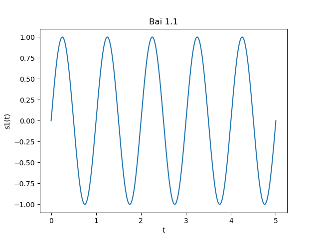
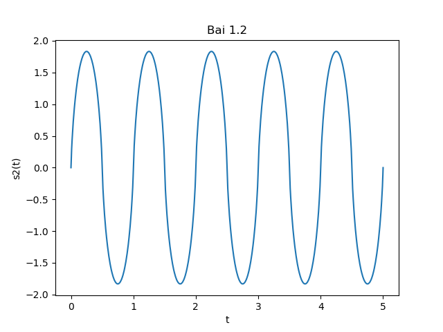

# Bài tập truyền thông đa phương tiện
### Thành viên nhóm:
```
Nguyễn Thanh Bình
Phạm Tiến Mạnh
Hoàng Đình Nam
Phan Tiến Phước
Nguyễn Hồng Quang
Lê Đức Toàn
Nguyễn Bá Toàn
```
### Cài đặt:
**Python version 3.7.5**\
**Các thư viện python sau:**
```
cycler==0.10.0
imageio==2.6.1
kiwisolver==1.1.0
matplotlib==3.1.2
numpy==1.17.4
opencv-python==4.1.2.30
Pillow==6.2.1
pyparsing==2.4.5
python-constraint==1.4.0
python-dateutil==2.8.1
scipy==1.3.3
six==1.13.0
```
### Hướng dẫn:
**Bài 1:**
* Lệnh:
```
python bai1-1.py
python bai1-2.py
```
* Kết quả:
  - Ta được đồ thị của 2 hàm như sau:
	<p float="middle">
		
		
	</p>